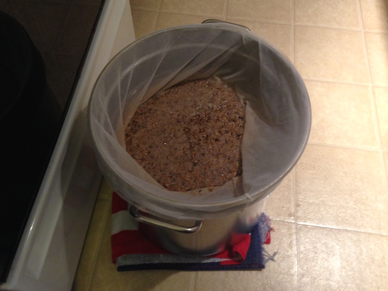
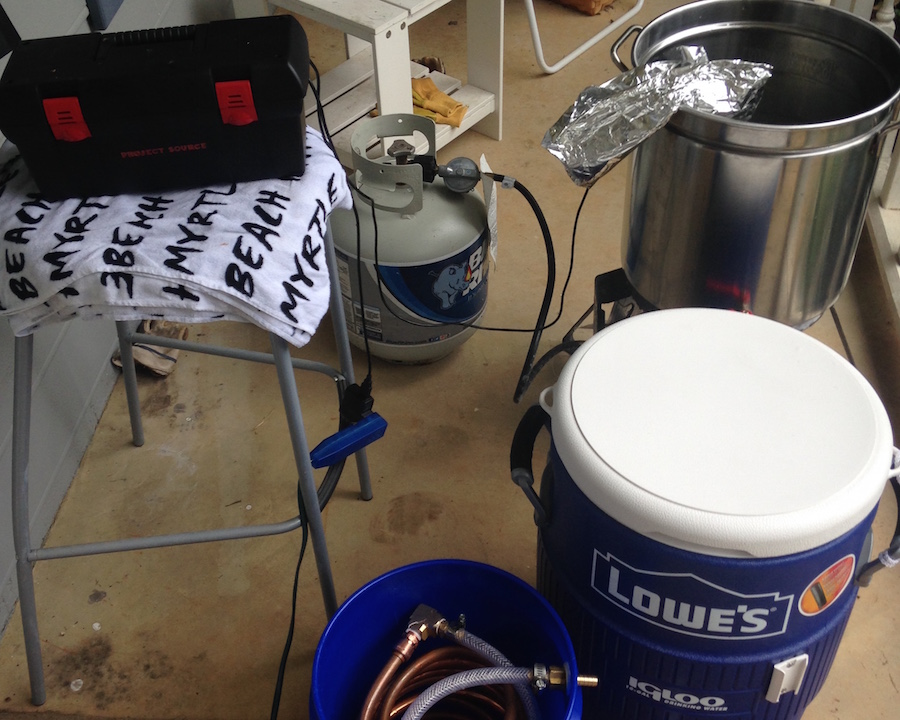
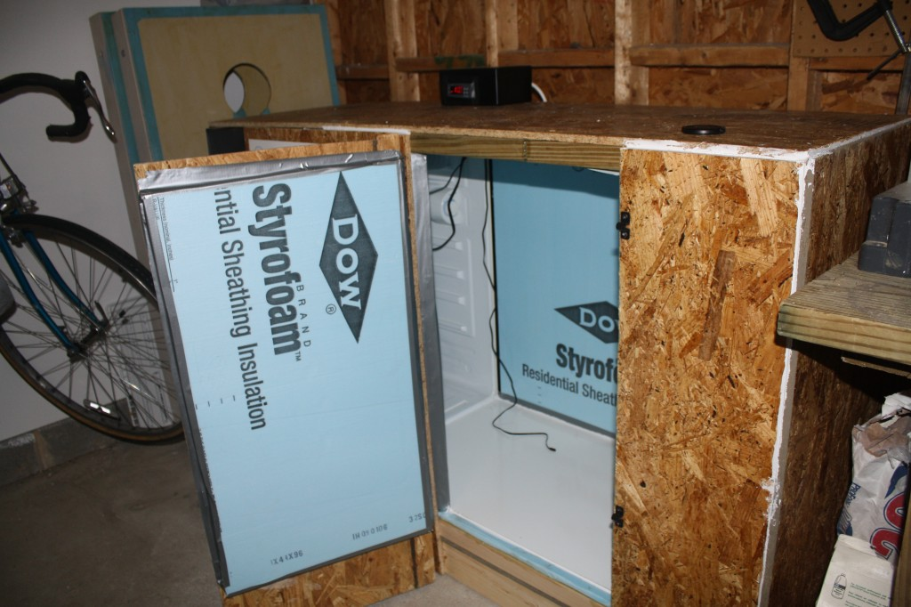

# HomebrewOps

Adding Automation and   Control to The Hobby of Homebrewing

---

# Homebrewer Evolution

---

---

# 5 Gallon Batches

---

# Partial Mash

---

# Kegging

---

# All Grain

---

# What's Next?

---

---

## Quality & Consistency = Control

---

# About Me

---

# Delivery Pipelines

---

# Virtual Engineer

---

# Putting Ops in Hops

---

# 1) Avoid Premature Optimization

---

## Rise of The BrewBots

---

---

---

---

# 2) Make it Work

---

---

---

---

# Then Make It Great

---

### The HomebrewOps Loop

---

## Adding Plumbing

---

### Lowes 10 Gallon Mash Tun

---

## Meet BrewTron

---

MashTron BoilTron FermentTron

---

RaspberryPI DS18B20 Sensor NodeJS Cylon.js

---

---

---

### Preparing the PI

sudo modprobe w1_gpio && sudo modprobe w1_therm

---

### Preparing the PI

echo "w1_gpio" >> /etc/modules
echo "w1_therm" >> /etc/modules

---

### Reading Sensor Data

/sys/bus/w1/devices/28-0000066fc63a/w1_slave

---

### Reading Sensor Data

56 01 4b 46 7f ff 0a 10 d1 : crc=d1 YES
56 01 4b 46 7f ff 0a 10 d1 t=21375

---

### Reading Sensor Data

56 01 4b 46 7f ff 0a 10 d1 : crc=d1 YES
56 01 4b 46 7f ff 0a 10 d1 t=21375

---

### Reading Sensor Data

21375 / 1000 = 21.375 C

21.375 * 9/5 + 32 = 70.475 F

---

### Reading Sensor Data

21375 / 1000 = 21.375 C

21.375 * 9/5 + 32 = 70.475 F

---

# Cylon.js Intro

---

### Robot

var Cylon = require('cylon')
...
Cylon.robot({
  work: function(my) {
    # Do Stuff
...
}).start();

---

### Robot

var Cylon = require('cylon')
...
Cylon.robot({
  work: function(my) {
    # Do Stuff
...
}).start();

---

### Robot

var Cylon = require('cylon')
...
Cylon.robot({
  work: function(my) {
    # Do Stuff
...
}).start();

---

### Connections

...
Cylon.robot({
  connections: {
    robot: { adaptor: "loopback" }
    },
  work: function(my) {
    my.robot.emit("some-event");
...

---

### Connections

...
Cylon.robot({
  connections: {
    robot: { adaptor: "loopback" }
    },
  work: function(my) {
    my.robot.emit("some-event");
...

---

### Devices

...
Cylon.robot({
  ...
  devices: {
    lcd: { driver: 'lcd' }
  },
  ...
  work: function(my) {
    my.lcd.print("Hello!");
...

---

### Devices

...
Cylon.robot({
  ...
  devices: {
    lcd: { driver: 'lcd' }
  },
  ...
  work: function(my) {
    my.lcd.print("Hello!");
...

---

### Utilities

...
  work: function(my) {
    every((10).seconds(), function(){
      my.sampleTemp(my);

      my.when(my.currentTemp >= my.waterTemp, function(){
        my.robot.emit("heat-water");
    });
...
    my.robot.once("heat-water", function(){
    # Only do this once
...

---

### Utilities

...
  work: function(my) {
    every((10).seconds(), function(){
      my.sampleTemp(my);

      my.when(my.currentTemp >= my.waterTemp, function(){
        my.robot.emit("heat-water");
    });
...
    my.robot.once("heat-water", function(){
    # Only do this once
...

---

### Utilities

...
  work: function(my) {
    every((10).seconds(), function(){
      my.sampleTemp(my);

      my.when(my.currentTemp >= my.waterTemp, function(){
        my.robot.emit("heat-water");
    });
...
    my.robot.once("heat-water", function(){
    # Only do this once
...

---

# 3) Measure All The Things

---

# StatsD

---

# Librato

---

---

# 4) Worst is Better

---

---

# 5) The Backlog

---

### Pumps

---

## Solenoid Valves

---

### Water Volume Sensor

---

### Cloud Controller

---

# Build A Community

---

---

---

---

---

---

---

## Open Homebrewing Automation Project

https://github.com/open-homebrewing-project

---

## Thank You!

---

## References

[DS18B20 Wiring and Setup for RaspberryPI](https://learn.adafruit.com/adafruits-raspberry-pi-lesson-11-ds18b20-temperature-sensing/hardware)   [More info on DS18B20](http://www.tweaking4all.com/hardware/arduino/arduino-ds18b20-temperature-sensor/)   [What Modules you will need](http://www.reuk.co.uk/DS18B20-Temperature-Sensor-with-Raspberry-Pi.htm)   [Installing Node.js on RaspberryPI](http://weworkweplay.com/play/raspberry-pi-nodejs/)   [Prevent Wifi Sleep](http://electronut.in/preventing-raspberry-pi-wifi-from-going-into-sleep-mode/)   [Cylon.js Docs](http://cylonjs.com/documentation/guides/working-with-robots/)

---

## Code

[MashTron](https://github.com/open-homebrewing-project/mashtron)   [BoilTron](https://github.com/open-homebrewing-project/boiltron)   [FermentTron](https://github.com/open-homebrewing-project/fermentron)
